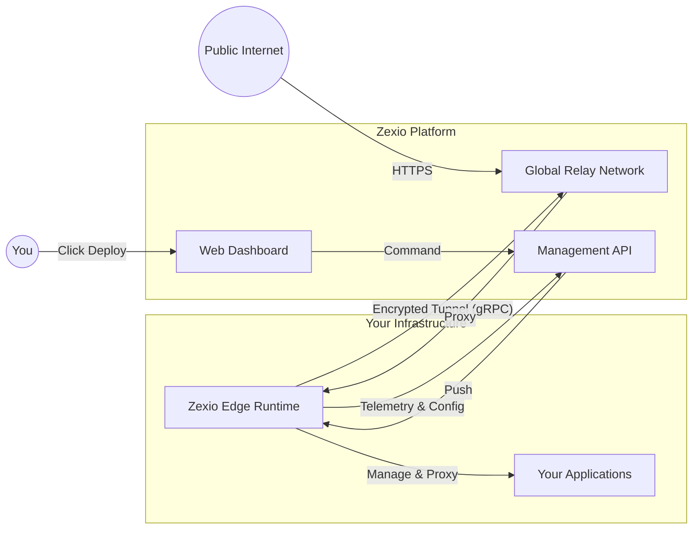

# Zexio Edge (CLI)

**Zexio Edge** is the lightweight runtime and command-line interface for the Zexio infrastructure platform. It runs on your edge servers (VPS, On-premise, Cloud) to securely connect them to the Zexio Cloud network.

## Features
- **Secure Tunneling**: Zero-config ingress to expose local services to the internet (`zexio up`).
- **Edge Deployment**: Orchestrate applications via Zexio Dashboard.
- **Service Management**: Built-in systemd/launchd manager for robust background operation.
- **Auto-Healing**: Automatic reconnection and state recovery.
- **Real-time Metrics**: CPU, Memory, and Network telemetry.

## 🚀 Quick Start (Linux/Server)

For headless servers, use the `connect` command for a non-interactive setup.

```bash
# 1. Install Zexio Edge
curl -sL https://get.zexio.io/edge | bash

# 2. Connect your node
# (Get your token from the Zexio Dashboard -> Add Node)
zexio connect zxp_YOUR_SECURE_TOKEN --install-service

# That's it! Your node is now online and managed by Zexio.
```

## 💻 Quick Start (Developer/Desktop)

For temporary tunnels or development testing on your local machine.

```bash
# 1. Authenticate (Interactive)
zexio login

# 2. Start a tunnel
zexio up 3000
```

## 📚 CLI Commands

### Core
| Command | Description |
|---------|-------------|
| `zexio connect <token>` | Connect to Zexio Cloud & register node (Headless/Server). |
| `zexio login` | Interactive login (Desktop). |
| `zexio logout` | Remove identity and credentials. |

### Service Management (Daemon)
Run Zexio Edge as a background service (Systemd/Launchd/Windows Service).

| Command | Description |
|---------|-------------|
| `zexio service install` | Install the agent as a system service. |
| `zexio service start` | Start the background service. |
| `zexio service stop` | Stop the background service. |
| `zexio service status` | Check service health. |

### Diagnostic & Utils
| Command | Description |
|---------|-------------|
| `zexio up <port>` | Start an ad-hoc tunnel to a local port. |
| `zexio doctor` | Check network connectivity, DNS, and permissions. |
| `zexio info` | Display Node ID, Region, and Specs. |
| `zexio update` | Update to the latest version. |
| `zexio version` | Show version info. |

## ⚙️ Configuration

Zexio Edge is designed to be **Zero-Config**. Most settings are managed via the Cloud Dashboard.
However, for advanced networking, you can use Environment Variables:

| Variable | Description | Default |
|----------|-------------|---------|
| `ZEXIO_RELAY_URL` | Custom Relay Endpoint | `wss://relay.zexio.io:443` |
| `ZEXIO_API_URL` | Management API | `https://api.zexio.io` |
| `ZEXIO_TOKEN` | Provisioning Token (Headless) | `None` |
| `HTTP_PROXY` | Proxy server URL | `None` |

## 📖 Architecture



## 🛠️ Building from Source

```bash
# Requirements: Rust (Cargo), OpenSSL
cargo build --release
# Binary: target/release/zexio
```

## 📄 License
Apache License 2.0 - see LICENSE file for details.
