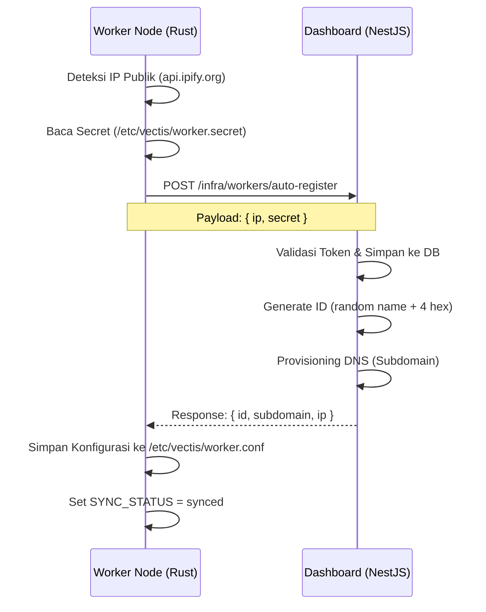
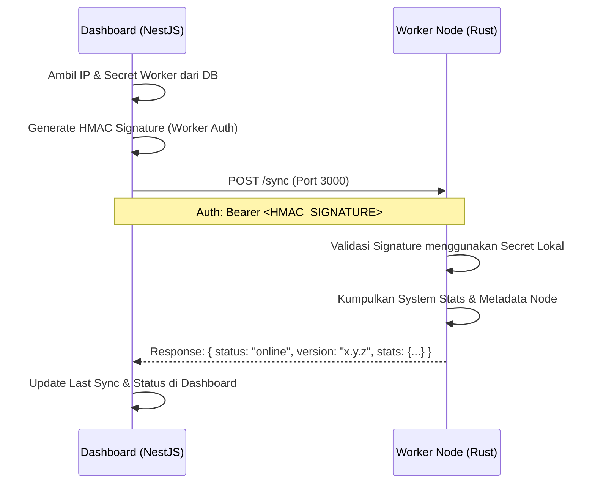

# Vectis Sync Flows

Berikut adalah rincian alur (flow) sinkronisasi antara **Dashboard** dan **Worker Node**.

## 1. Flow Registrasi Otomatis (Worker → Dashboard)
Alur ini terjadi saat pertama kali instalasi menggunakan `install.sh`.

---

## 2. Flow Sinkronisasi Manual (Dashboard → Worker)
Alur ini terjadi saat User menekan tombol "Sync" di Dashboard atau saat Dashboard melakukan pengecekan kesehatan berkala.

## Status Sinkronisasi

1.  **`pending`**: Worker sudah terinstall tapi belum berhasil registrasi ke Dashboard (biasanya karena `VECTIS_TOKEN` kosong).
2.  **`synced`**: Worker dan Dashboard sudah terhubung dan data sinkron.
3.  **`failed`**: Upaya sinkronisasi terakhir gagal (misal: Worker mati atau IP berubah).
4.  **`outdated`**: Ada perubahan konfigurasi di Dashboard yang belum diterapkan ke Worker.

## Perintah Penting di Worker Node

-   `vectis-status`: Melihat status sinkronisasi saat ini.
-   `vectis-sync`: Melakukan pendaftaran/update manual ke Dashboard.
