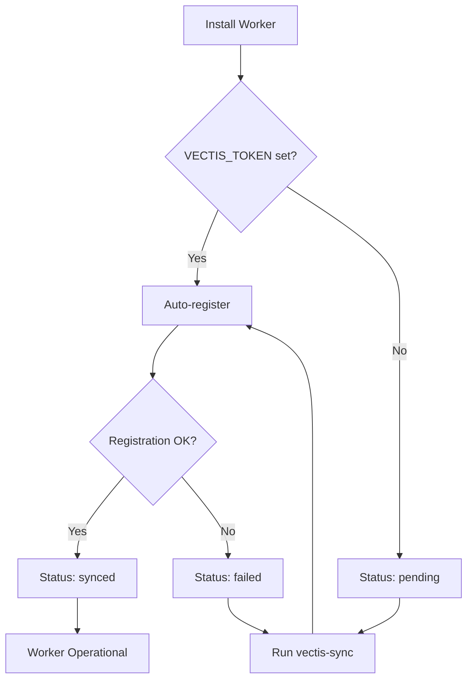

# Worker Sync Status

## Sync Status Values

| Status | Description | Action Required |
|--------|-------------|-----------------|
| `pending` | Worker installed but not registered | Run `VECTIS_TOKEN=xxx vectis-sync` |
| `synced` | Successfully registered with dashboard | None - worker is operational |
| `failed` | Registration/sync attempt failed | Check error message, retry with `vectis-sync` |
| `outdated` | Worker config changed, needs re-sync | Run `vectis-sync` to update |

## Configuration File

**Location:** `/etc/vectis/worker.conf`

```bash
WORKER_ID=wrk_abc123
SUBDOMAIN=worker-a1b2c3.vectis.dev
PUBLIC_IP=203.0.113.5
SYNC_STATUS=synced
LAST_SYNC=2026-01-11T06:23:00Z
ERROR_MESSAGE=  # Only present if status=failed
```

## Commands

### Check Status
```bash
vectis-status
```

**Output:**
```
Worker Status
=============
Worker ID:    wrk_abc123
Subdomain:    worker-a1b2c3.vectis.dev
Public IP:    203.0.113.5
Sync Status:  synced
Last Sync:    2026-01-11T06:23:00Z
Service:      Running
```

### Sync with Dashboard
```bash
VECTIS_TOKEN=your_token vectis-sync
```

**Output:**
```
Syncing with dashboard...
✅ Sync successful!
   Subdomain: worker-a1b2c3.vectis.dev
   Worker ID: wrk_abc123
```

## Registration Payload

**Request:**
```json
POST /api/v1/workers
Authorization: Bearer {VECTIS_TOKEN}

{
  "ip": "203.0.113.5",
  "secret": "worker_secret_here"
}
```

**Response:**
```json
{
  "id": "wrk_abc123",
  "subdomain": "worker-a1b2c3.vectis.dev",
  "ip": "203.0.113.5"
}
```

**Note:** Dashboard echoes back the IP for verification purposes.

## Sync Flow



## Status Transitions

```
pending → synced    (successful registration)
pending → failed    (registration error)
failed → synced     (successful retry)
synced → outdated   (config changed)
outdated → synced   (successful re-sync)
```
